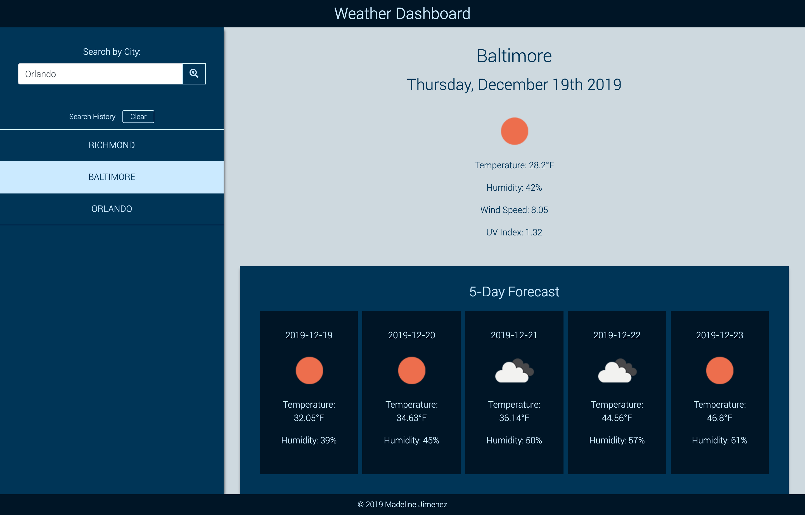
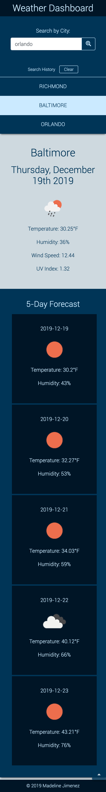

# Bootcamp Weather Dashboard

## Screenshots of Application

## Live Link
- Launch the application [here](https://mijimenez.github.io/bootcamp_weather_dashboard/)

## User Story
- As a person who likes to prepare for the week
- I want a way to check the weather
- so that I can determine the weather for any given city within the next 5 days

## Acceptance Criteria
- Given that I provide a valid city name
- When I hit "search"
- then the current weather and the 5-day forecast are generated with a search history of past city searches

- - -
© 2019 Madeline Jimenez